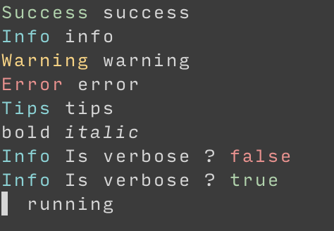

# Messages

Messages is a toolbox for CLI output with no pretension.

- It will setup [aurora](https://github.com/logrusorgru/aurora) is tty is detected (you can force it)
- You can easily switch output to stdout or stderr
- Write message with a level (info, warn, error, fatal as prefix)
- Set context value for getting/set state in your CLI (like verbose mode, debug mode, etc...)
- Add a spinner to your cli from [yacspin](https://github.com/theckman/yacspin) and null one if you want 
  to not take care when you should show spinner or you should avoid it.

## Usage

Get the package:

```shell
go get github.com/ArthurHlt/messages
```

Import it, example:

```go
package main

import (
	msg "github.com/ArthurHlt/messages"
	"time"
)

func main() {
	msg.Success("success")
	msg.Debug("debug")
	msg.Info("info")
	msg.Warning("warning")
	msg.Error("error")
	// next command will exit with code 1
	// messages.Fatal("fatal")
	msg.Tips("tips")

	msg.Printf("%s %s\n", msg.Bold("bold"), msg.Italic("italic"))

	msg.Infof("Is verbose ? %t", msg.Red(msg.IsContextValue("verbose")))
	msg.SetContextValue("verbose", true)
	msg.Infof("Is verbose ? %t", msg.Green(msg.IsContextValue("verbose")))

	imInTerminal := true
	exampleSpin(imInTerminal) // will show a spinner in terminal
	imInTerminal = false
	exampleSpin(imInTerminal) // will not display anything but keep the same code for both

}

func exampleSpin(imInTerminal bool) {
	spin := msg.GetSpinner(!imInTerminal)
	spin.Message("running")
	spin.Start()
	time.Sleep(2 * time.Second)
	spin.Stop()
}
```

This will output:


